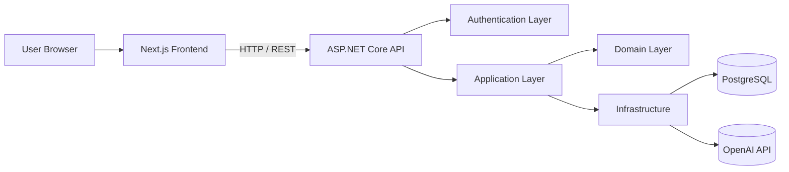
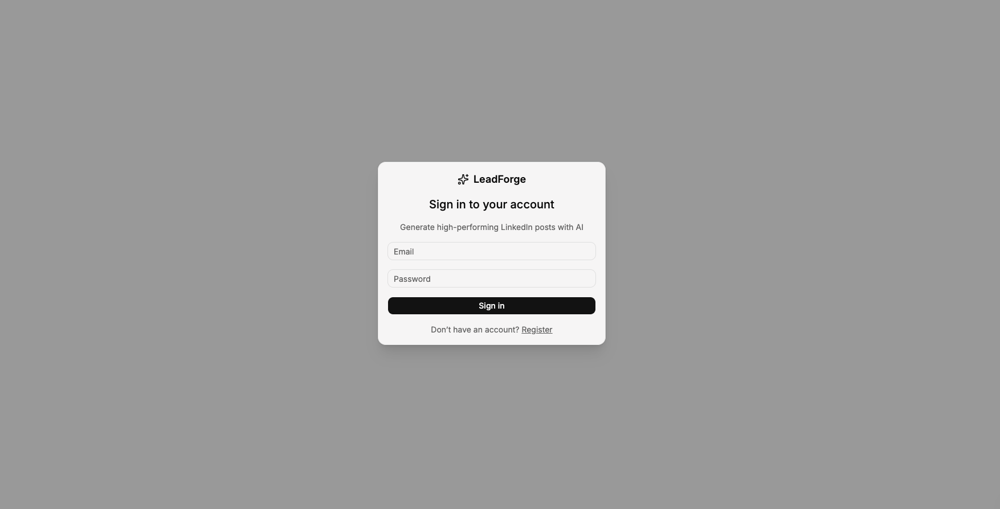
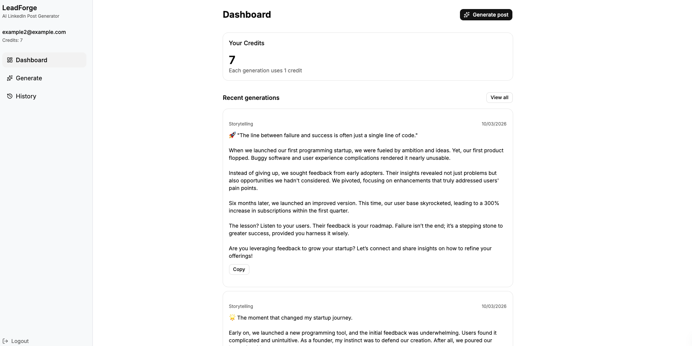
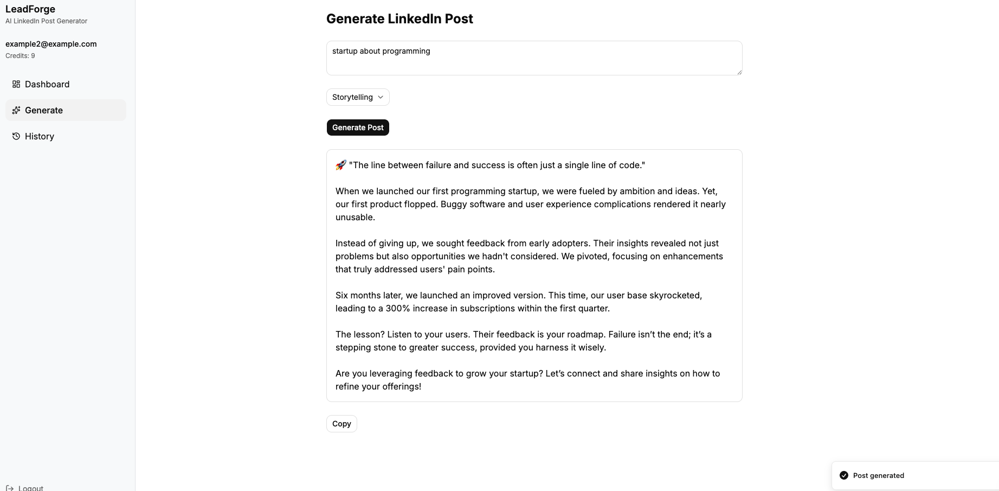

# LeadForge

AI-powered LinkedIn post generator built with **.NET 8 and Next.js**.

LeadForge helps founders, developers and agencies generate high-quality
LinkedIn posts designed to drive engagement and inbound leads.

------------------------------------------------------------------------

## Features

-   AI-powered LinkedIn post generation using OpenAI
-   Authentication with **JWT + Refresh Tokens**
-   Credits system controlling AI usage
-   Generation history with **pagination**
-   Rate limiting for AI requests
-   Request validation using **FluentValidation**
-   Global exception handling middleware
-   Health check endpoint (`/health`)
-   Automatic database migrations on startup
-   Modern **React / Next.js dashboard**
-   Data fetching with **React Query**
-   Dockerized full‑stack environment

------------------------------------------------------------------------

## Tech Stack

### Backend

-   .NET 8
-   ASP.NET Core Web API
-   Entity Framework Core
-   PostgreSQL
-   FluentValidation
-   Serilog
-   JWT Authentication
-   OpenAI API
-   Clean Architecture

### Frontend

-   Next.js
-   React
-   React Query
-   TailwindCSS
-   shadcn/ui
-   TypeScript

### DevOps

-   Docker
-   Docker Compose
-   Dev / Production environments
-   Environment variables via `.env`

------------------------------------------------------------------------

## Architecture

The backend follows a **Clean Architecture inspired structure**.

### Backend Layers

-   **API Layer** → Controllers, middleware and HTTP endpoints
-   **Application Layer** → Business logic and services
-   **Domain Layer** → Entities and domain rules
-   **Infrastructure Layer** → Database access and external integrations

------------------------------------------------------------------------

## Screenshots

### Login

### Dashboard

### Generate Post

------------------------------------------------------------------------

## Demo Account

You can log in with the demo account:

    email: demo@leadforge.ai
    password: demo123

------------------------------------------------------------------------

## Running the Project

Clone the repository:

    git clone https://github.com/yourname/leadforge
    cd leadforge

------------------------------------------------------------------------

## Development Environment

Start the development environment:

    docker compose -f docker-compose.dev.yml up

Services:

    Frontend  → http://localhost:3000
    API       → http://localhost:8080
    Postgres  → localhost:5432

The development environment uses:

-   `dotnet watch` for hot reload
-   `next dev` for fast frontend refresh
-   mounted volumes for instant code updates

------------------------------------------------------------------------

## Production-like Environment

To build and run the production containers:

    docker compose up --build

This will build:

-   .NET API production image
-   Next.js production build
-   PostgreSQL container

------------------------------------------------------------------------

## Environment Variables

Create a `.env` file from the template:

    cp .env.example .env

Example variables:

    OPENAI_API_KEY=your_openai_api_key

The `.env` file is **not committed to the repository** for security
reasons.

------------------------------------------------------------------------

## Project Structure

    leadforge
    │
    ├ docker-compose.yml
    ├ docker-compose.dev.yml
    ├ Makefile
    │
    ├ api
    │   ├ Dockerfile
    │   ├ LeadForge.sln
    │   └ LeadForge/
    │
    ├ frontend
    │   ├ Dockerfile
    │   └ src/
    │
    ├ docs
    │   ├ login.png
    │   ├ dashboard.png
    │   └ generate.png
    │
    └ README.md

------------------------------------------------------------------------

## Health Check

The API exposes a health endpoint:

    GET /health

This endpoint is useful for monitoring and container orchestration.

------------------------------------------------------------------------

## Future Improvements

-   Stripe payments and subscription plans
-   Redis caching
-   AI prompt analytics
-   Multi-user workspaces
